# Pgr-Old-Avatar-XML

Phigros 2.0.0 以前商店头像和2026年愚人节头像的 XML 数值与头像图片备份。

这些头像在当前版本中无法正常获取，仅供 root / 虚拟机环境获取与研究使用。

图片素材来源：[Phigros 全头像获取攻略 - 原启Yuanqi](https://www.bilibili.com/opus/1186626870393700370)

## 使用方法

需要 root 或虚拟机环境。

1. 虚拟机开启 root。
2. 使用 `Shizuku` 在 root 下运行。
3. 授权给 MT 管理器。
4. 打开：

```text
/data/user/0/com.PigeonGames.Phigros/shared_prefs/com.PigeonGames.Phigros.v2.playerprefs.xml
```

5. 在 `com.PigeonGames.Phigros.v2.playerprefs.xml` 里填入对应的头像 XML 值。
6. 保存后，移动或删除 MT 管理器自动生成的备份文件即可。
   也可以把`com.PigeonGames.Phigros.v2.playerprefs.xml`文件属性改成只读（但目前无法确定会不会影响上传存档）

---

## 1. Geopelia 1-by cycats

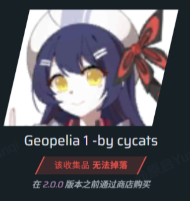

```xml
<string name="1So2ylZIyUcCo97%2FyQod3jTu7NhxaRjtyfwEaq1LsEmU9tSmQDM4TmBQbsJ6x4fF0Inzui7OWnc%3D">xq9bX8oShzg%3D</string>
```

---

## 2. Geopelia 2-by cycats

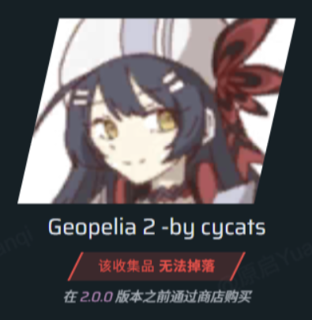

```xml
<string name="1So2ylZIyUcCo97%2FyQod3jTu7NhxaRjt6RP8lLX40zhL5iSKtZRH8P2saSJ9zb9zr7%2BwER6mSoU%3D">xq9bX8oShzg%3D</string>
```

---

## 3. Engine x Start!! extra1-by cycats

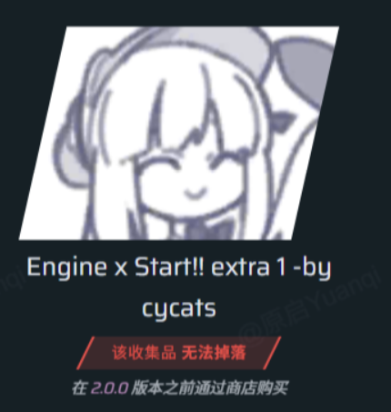

```xml
<string name="1So2ylZIyUcCnXT5mbjGnzoIH%2FVuZroJuQgqaJAGRDCM2Jpkb9WbkkVZHnSHHyOMf%2BSGaXd32HD7okoNwJS5ct3PF6hdNs84aaw3IPsVYXk%3D">xq9bX8oShzg%3D</string>
```

---

## 4. FULi AUTO SHOOTER extra1-by cycats

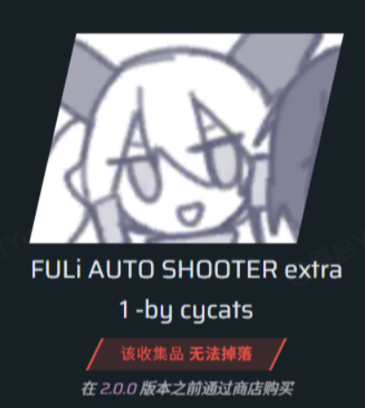

```xml
<string name="1So2ylZIyUekC2MIv2zaV7jyUQYuf%2FFWXdyenhrt0rV0yGR2hsEZBz3VM%2FYbIoEaKvdVOANtjmULV3dvascdVPsTPqa7AhCEd86oq4g9BeR0Gx5YbiXRAQ%3D%3D">xq9bX8oShzg%3D</string>
```

---

## 5. Non-Melodic Ragez extra 1-by cycats

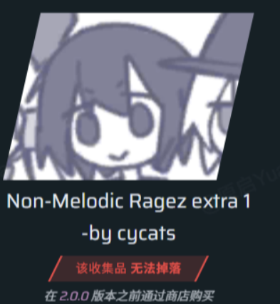

```xml
<string name="1So2ylZIyUfjMztXoUK0uetrYxJKDx8in5fkJ8uMXE8wrPcmFpeMAtyPJISEyanxHvR7RgDpCbWkZfSV0oz0uOD316ZTPBHoX3T2wbd%2FVXf2P5Ks92jC8A%3D%3D">xq9bX8oShzg%3D</string>
```

---

## 6. RIPPER extra 1-by cycats

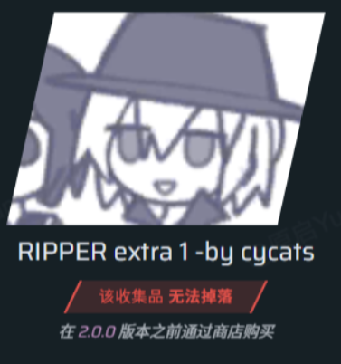

```xml
<string name="1So2ylZIyUe%2B5oDIVwKlDb5wAov9IErvje3iilRqUCuVY%2FD5n7%2FYqvz27RWqKbilTsqxdURV23yriAh9YGq%2FsA%3D%3D">xq9bX8oShzg%3D</string>
```

---

## 7. RIPPER extra 2-by 何呵

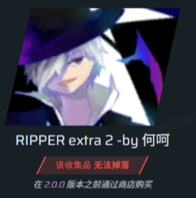

```xml
<string name="1So2ylZIyUe%2B5oDIVwKlDb5wAov9IErvje3iilRqUCsfeOF1yW47ETFmm%2B6TmNzh7yw6a5DOCe0%3D">xq9bX8oShzg%3D</string>
```

---

## 8. Geopelia 3-by 何呵

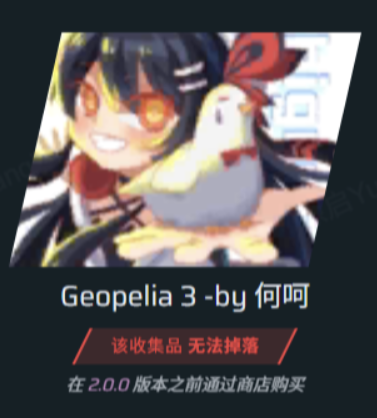

```xml
<string name="1So2ylZIyUcCo97%2FyQod3jTu7NhxaRjtHqh129hoW7OD0tVvEqaVInk76Iup1OEi">xq9bX8oShzg%3D</string>
```

---

## 9. Khronostasis Katharsis

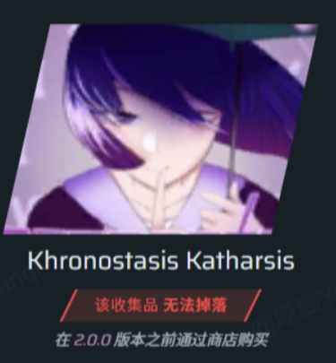

```xml
<string name="1So2ylZIyUc6HVbUUctHgjJpC6VwlqXD0WOqT48UDEQTadurz1Uf%2Fydx0g3FQN5LadZZSZXfJDs%3D">xq9bX8oShzg%3D</string>
```

---

## 10. Sparkle New Life

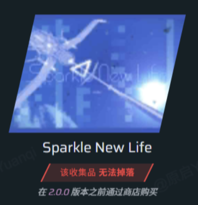

```xml
<string name="1So2ylZIyUeYQfwqFIvJkSS0uMDrICzse20Vmgio9QejTyOuFMSL1UmDg0U%2F11X3">xq9bX8oShzg%3D</string>
```

---

## 11. Find_Me

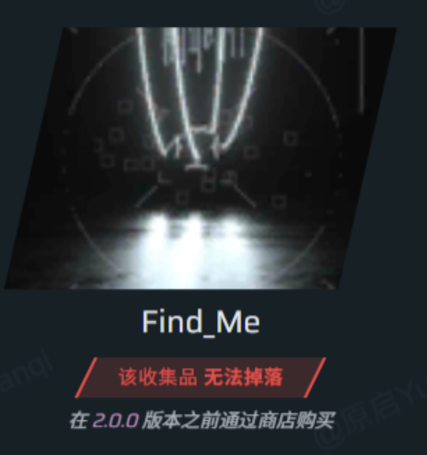

```xml
<string name="1So2ylZIyUdeSwrgH6p%2BuNyww1Oed0Fo">xq9bX8oShzg%3D</string>
```

---

## 12. Sein

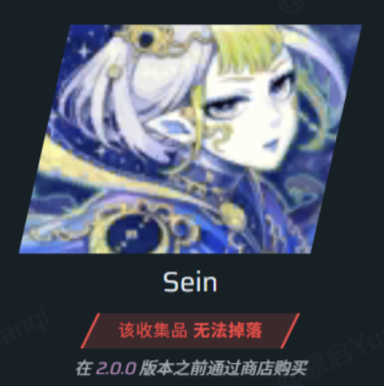

```xml
<string name="1So2ylZIyUffp0qDjw117uvTDWOSwbB9">xq9bX8oShzg%3D</string>
```

---

## 13. 狂喜蘭舞1

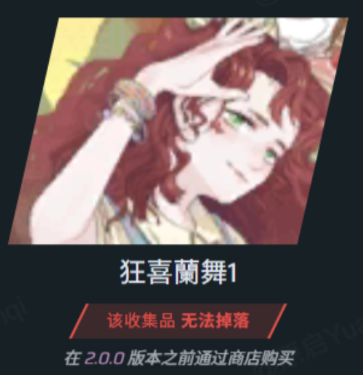

```xml
<string name="1So2ylZIyUeK2VFx1I3cgA6MoG1X%2FK8x">xq9bX8oShzg%3D</string>
```

---

## 14. 狂喜蘭舞2

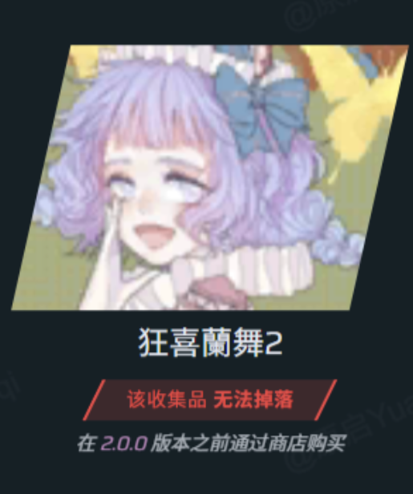

```xml
<string name="1So2ylZIyUeK2VFx1I3cgL6n%2FAxWtlDr">xq9bX8oShzg%3D</string>
```

---

## 15. Marenol extra 1-by 喵n葵

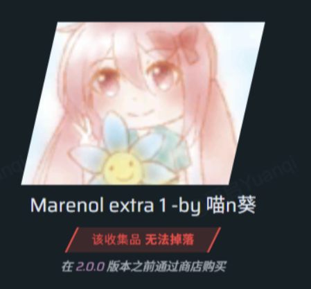

```xml
<string name="1So2ylZIyUdgLKyL3fWbE8HVv0RXhbUd82OZ7CwABGtQehFk9EiDnvU83btvG08pjdQ%2BZyR9yhM%3D">xq9bX8oShzg%3D</string>
```

---

## 16. 云女孩extra 1-by 御坂果子

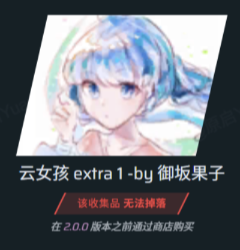

```xml
<string name="1So2ylZIyUdZwjhf6VOPwdzZuXGDNB3hkMW4Eh2bibBiDvBo3NAFYhyZk9Ak%2BSb2qWwu2JYXe6o%3D">xq9bX8oShzg%3D</string>
```

---

## 17. Christmas

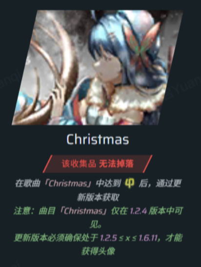

```xml
<string name="1So2ylZIyUdXA2nX%2FPoMLKQn37s%2FKJoiomL2e%2BzRTCkuxaDK7pVxrQ%3D%3D">xq9bX8oShzg%3D</string>
```

---

## 18. Geopelia in WEPLAY-by 海产

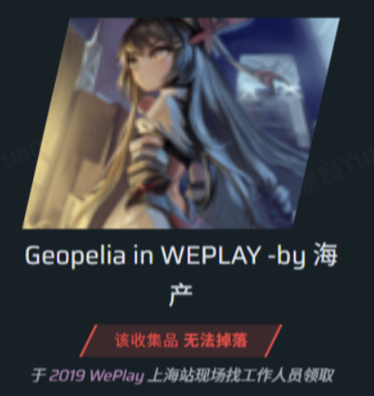

```xml
<string name="4mIcEevygkF9%2F9WIeTdXDegRFvK5ggQb%2F3p2lAtvqKV5MA25ie43aBOA9kHp4Mux">84nt4CDG41fhF5EXHkVpow%3D%3D</string>
```

---

## 19. Snow Desert

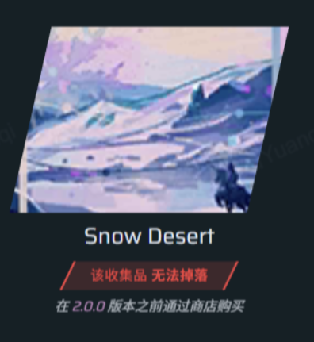

```xml
<string name="1So2ylZIyUcvT2cK1hAc8%2Bdqnnpmk%2BiJ">xq9bX8oShzg%3D</string>
```

---

## 20. Burn

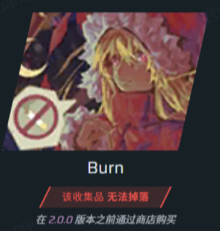

```xml
<string name="1So2ylZIyUfGh8GJ9Gfi8JVZSzk9C0qmu2iyyaeDPnQ%3D">xq9bX8oShzg%3D</string>
```
## 22. Gino-AprilFool

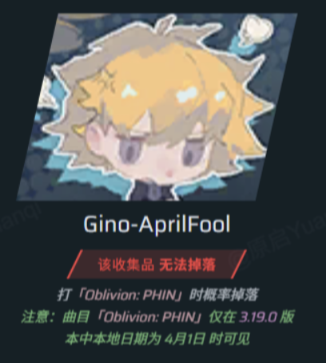

```xml
<string name="b8UKKnNidrS6zp9eA6cRlKvm8%2F0u5rt2bWkU1oB8ss8%3D">84nt4CDG41fhF5EXHkVpow%3D%3D</string>
```

---

## 23. Oblivion:PHIN

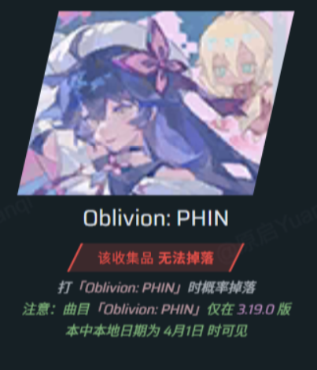

```xml
<string name="p0PsZStllosA%2FOuKCiZISoEOoNFkzxN4Nurdg4YWExw%3D">84nt4CDG41fhF5EXHkVpow%3D%3D</string>
```

---

## 24. 鸠-AprilFool

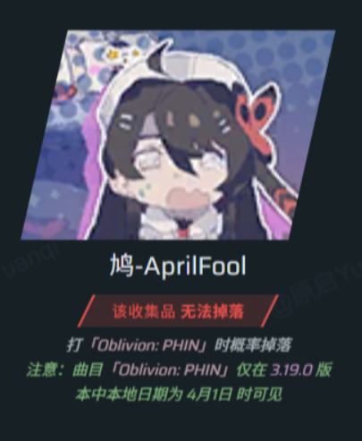

```xml
<string name="F%2BWxa1d3PylrBRCLIEyKORIPowSaM8oka51LnCmf3Ng%3D">84nt4CDG41fhF5EXHkVpow%3D%3D</string>
```

---

## 25. Glaciaxion

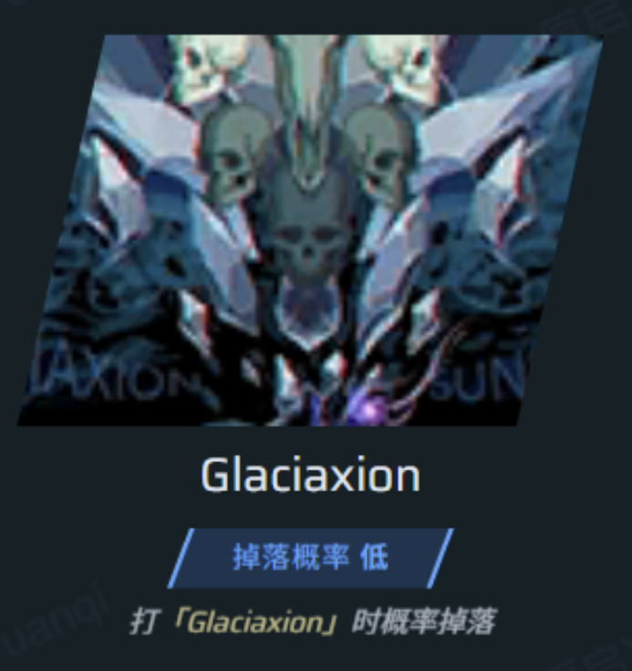

```xml
<string name="1So2ylZIyUdI9WM1XjLa5U%2Fl73EqztHWQ6ZCHD1xlLI%3D">xq9bX8oShzg%3D</string>
```

---

## 免责声明

本仓库仅用于对 Phigros 旧版头像获取与技术交流，请勿用于商业用途或破坏游戏公平性。本仓库不涉及更改分数、RKS、暴力解析存档等行为。请自行承担使用 root、虚拟机、文件修改等操作带来的风险。若有侵权请联系[我的 B 站主页](https://space.bilibili.com/626182490)，我会尽快处理。
